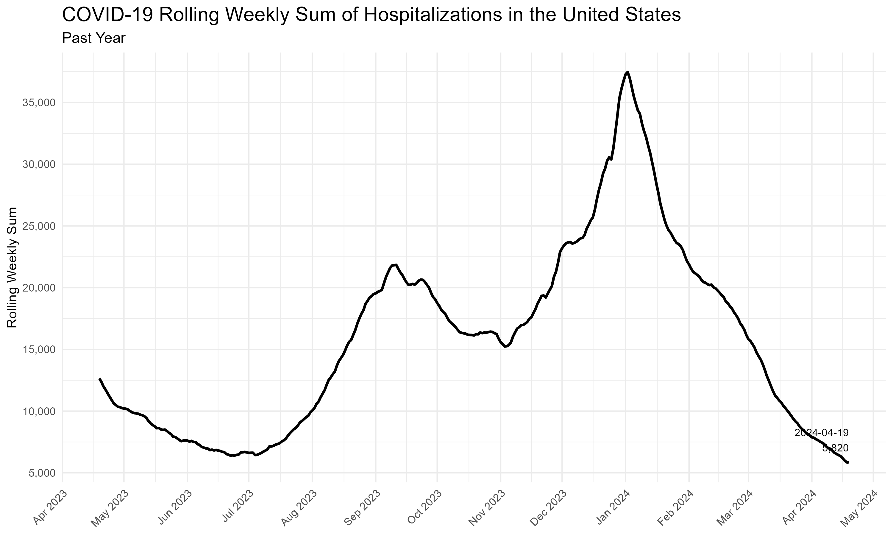
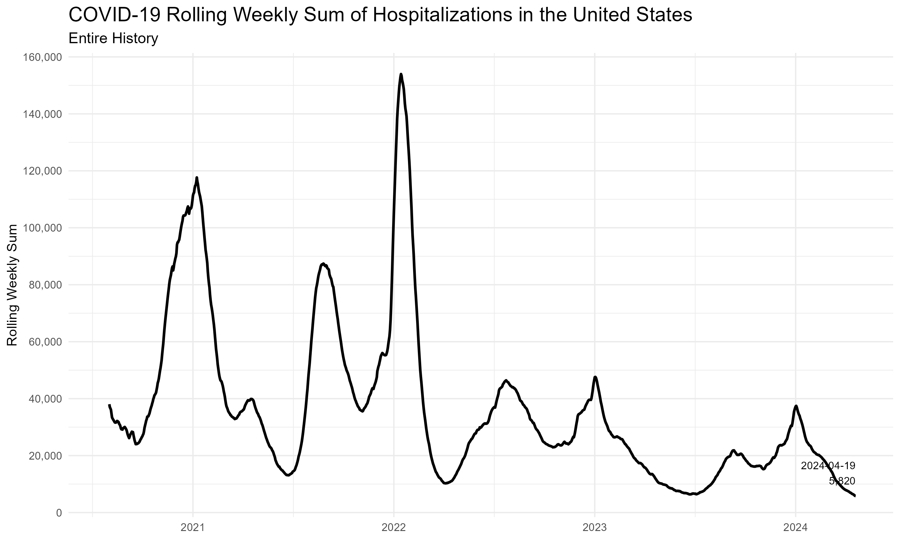
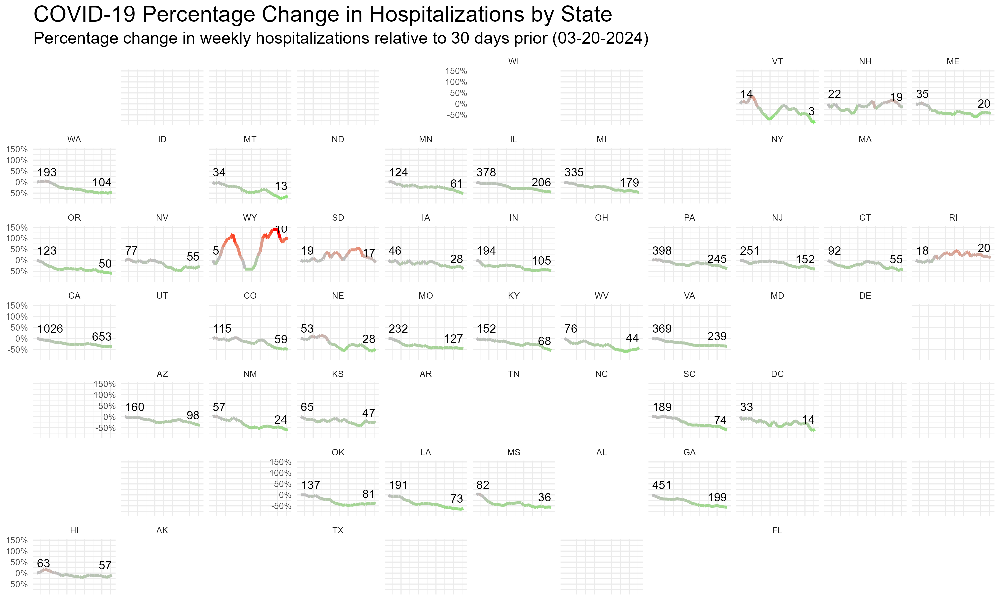

Last updated: `r format(Sys.time(), '%B %d, %Y')`

This page contains plots of COVID hospitalizations in the US. The data comes from the [COVID-19 Forecast Hub](https://covid19forecasthub.org/) using their [data-truth](https://github.com/reichlab/covid19-forecast-hub/tree/master/data-truth) hospitalizations figures. See their [repository](https://github.com/reichlab/covid19-forecast-hub/tree/master/data-truth) for more details on the data. Data comes from the file `truth-Incident Hospitalizations.csv`.

Click the "Code" buttons to see the R code used on this page. An R Markdown file of this page is [available here](https://github.com/ryooan/ryooan.github.io/tree/master/forecasting) for anyone who wishes to download and run or modify it themselves.

```{r message=FALSE, warning=FALSE, fig.show='hide'}
library(tidyverse)
library(lubridate)
library(geofacet)
library(usdata)
library(zoo)
library(scales)
library(kableExtra)

url <- "https://media.githubusercontent.com/media/reichlab/covid19-forecast-hub/master/data-truth/truth-Incident%20Hospitalizations.csv"

covid_data <- read_csv(url)

# Convert dates to Date objects
covid_data <- covid_data %>%
  mutate(date = ymd(date)) %>%
  filter(location_name != "Virgin Islands")

# Replace full state names with abbreviations using state2abbr function
covid_data$abbr <- state2abbr(covid_data$location_name)

# Calculate daily sums (preserving original data structure)
covid_data_daily <- covid_data %>%
  group_by(location_name, abbr, date) %>%
  summarize(daily_sum = sum(value, na.rm = TRUE), .groups = "drop")

# Calculate rolling sums for the last seven days, computed daily
covid_data_daily <- covid_data_daily %>%
  arrange(location_name, date) %>%
  group_by(location_name, abbr) %>%
  mutate(rolling_weekly_sum = rollsumr(daily_sum, 7, fill = NA, align = 'right')) %>%
  ungroup()

# Find the latest date in covid_data_daily
latest_date <- max(covid_data_daily$date)

# Determine the reference rolling weekly sum for each state 30 days before the latest date
reference_date <- latest_date - days(30)
covid_data_reference <- covid_data_daily %>%
  filter(date == reference_date) %>%
  select(location_name, abbr, rolling_weekly_sum)

# Create dataset for "United States"
us_covid_data <- covid_data_daily %>%
  filter(location_name == "United States")

# Join with the main data to compute percentage change
covid_data_daily <- covid_data_daily %>%
  left_join(covid_data_reference, by = c("location_name", "abbr"), suffix = c("", "_ref")) %>%
  mutate(weekly_percentage_change = (rolling_weekly_sum / rolling_weekly_sum_ref - 1) * 100) %>%
  filter(date <= latest_date & date >= reference_date) # Filter for the 30 days up to the latest date

# Filter out rows with NA in the state abbreviation or percentage change
covid_data_daily <- filter(covid_data_daily, !is.na(abbr) & !is.na(weekly_percentage_change))

# Find the first and last date for each state
first_last_dates <- covid_data_daily %>%
  group_by(location_name, abbr) %>%
  summarize(first_date = min(date), last_date = max(date), .groups = "drop")

# Join this information back to the main dataset
covid_data_daily <- covid_data_daily %>%
  left_join(first_last_dates, by = c("location_name", "abbr"))

# Determine the points to annotate
annotate_points <- covid_data_daily %>%
  filter(date == first_date | date == last_date) %>%
  select(location_name, abbr, date, rolling_weekly_sum, weekly_percentage_change, first_date, last_date)

# Define a threshold for y-value
y_threshold <- max(covid_data_daily$weekly_percentage_change) * 0.9

# Format the reference date as a character string
formatted_reference_date <- format(reference_date, "%m-%d-%Y")

# Plot the data, using state abbreviations for faceting
state_plot <- ggplot(covid_data_daily, aes(x = date, y = weekly_percentage_change)) +
  geom_line(aes(color = weekly_percentage_change), size = 1) +
  geom_text(data = annotate_points, 
            aes(label = round(rolling_weekly_sum), 
                y = ifelse(weekly_percentage_change > y_threshold, 
                           weekly_percentage_change - 50, 
                           weekly_percentage_change + 50),
                hjust = ifelse(date == first_date, -0, 1)), # Adjust hjust based on date
            check_overlap = TRUE, size = 3) +
  facet_geo(~ abbr, grid = "us_state_grid1") +
  labs(title = "COVID-19 Percentage Change in Hospitalizations by State",
       subtitle = paste("Percentage change in weekly hospitalizations relative to 30 days prior (", formatted_reference_date, ")", sep = ""),
       x = element_blank(),
       y = element_blank()) +
  scale_color_gradient2(low = "green", mid = "gray", high = "red", midpoint = 0, guide = FALSE) +
  scale_y_continuous(labels = label_percent(scale = 1)) +
  theme_minimal(base_size = 8) +
  theme(
    axis.text.x = element_blank(),
    axis.ticks.x = element_blank(),
    axis.line.x = element_blank(),
    axis.line.y = element_blank(),
    plot.title = element_text(size = 16),
    plot.subtitle = element_text(size = 12),
    strip.background = element_rect(color = "white")
  )

# Find the latest point in US data for annotation
latest_us_data <- us_covid_data %>%
  filter(date == max(date)) %>%
  select(date, rolling_weekly_sum)

# Annotation text for the latest point
annotate_text <- paste(latest_us_data$date, "\n", scales::comma(latest_us_data$rolling_weekly_sum), sep = "")

# Plot for the entire history of US data
us_history_plot <- ggplot(us_covid_data, aes(x = date, y = rolling_weekly_sum)) +
  geom_line(color = "black", size = 1) +
  geom_text(data = latest_us_data, aes(label = annotate_text, x = date, y = rolling_weekly_sum), 
            vjust = -0.5, hjust = 1, color = "black", size = 3) +
  scale_y_continuous(labels = scales::comma, breaks = scales::pretty_breaks(n = 6)) +
  labs(title = "COVID-19 Rolling Weekly Sum of Hospitalizations in the United States",
       subtitle = "Entire History",
       x = element_blank(),
       y = "Rolling Weekly Sum") +
  theme_minimal() +
  theme(
    plot.title = element_text(size = 16),
    plot.subtitle = element_text(size = 12)
  )

# Plot for the past year of US data
one_year_ago <- latest_date - years(1)
us_covid_data_recent <- us_covid_data %>%
  filter(date >= one_year_ago)

us_recent_plot <- ggplot(us_covid_data_recent, aes(x = date, y = rolling_weekly_sum)) +
  geom_line(color = "black", size = 1) +
  geom_text(data = latest_us_data, aes(label = annotate_text, x = date, y = rolling_weekly_sum), 
            vjust = -0.5, hjust = 1, color = "black", size = 3) +
  scale_x_date(date_breaks = "1 month", date_labels = "%b %Y") +
  scale_y_continuous(labels = scales::comma, breaks = scales::pretty_breaks(n = 10)) +
  labs(title = "COVID-19 Rolling Weekly Sum of Hospitalizations in the United States",
       subtitle = "Past Year",
       x = element_blank(),
       y = "Rolling Weekly Sum") +
  theme_minimal() +
  theme(
    plot.title = element_text(size = 16),
    plot.subtitle = element_text(size = 12),
    axis.text.x = element_text(angle = 45, hjust = 1)
  )

ggsave("state_plot.png", state_plot, width = 10, height = 6, dpi = 300, bg = "white")
ggsave("us_history_plot.png", us_history_plot, width = 10, height = 6, dpi = 300, bg = "white")
ggsave("us_recent_plot.png", us_recent_plot, width = 10, height = 6, dpi = 300, bg = "white")

#creating and formatting values for table view
us_covid_table <- us_covid_data %>% select(date,daily_sum,rolling_weekly_sum)
us_covid_table <- us_covid_table %>% arrange(desc(date))
us_covid_table <- us_covid_table %>%
  mutate(daily_sum = scales::comma(daily_sum),
         rolling_weekly_sum = scales::comma(rolling_weekly_sum))

us_covid_kbl <- kbl(us_covid_table,col.names = c("Date","Hospitalizations - Daily","Hospitalizations - Past Week")) %>%
  kable_minimal(full_width = F) %>%
  column_spec(1:3,width = "10em") %>%
  scroll_box(height = "500px")
```




```{r message=FALSE, warning=FALSE}

us_covid_kbl

```

&nbsp;
&nbsp;

The figure below shows the relative change in weekly hospitalizations in each state in the most recent 30 days, relative to the figure from 30 days ago. The starting and ending weekly sum of hospitalizations are shown on each chart.

