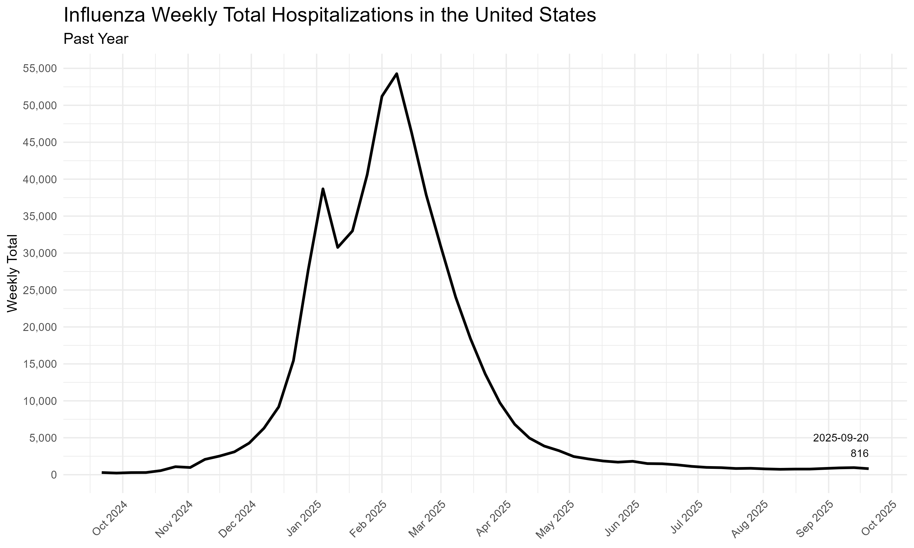
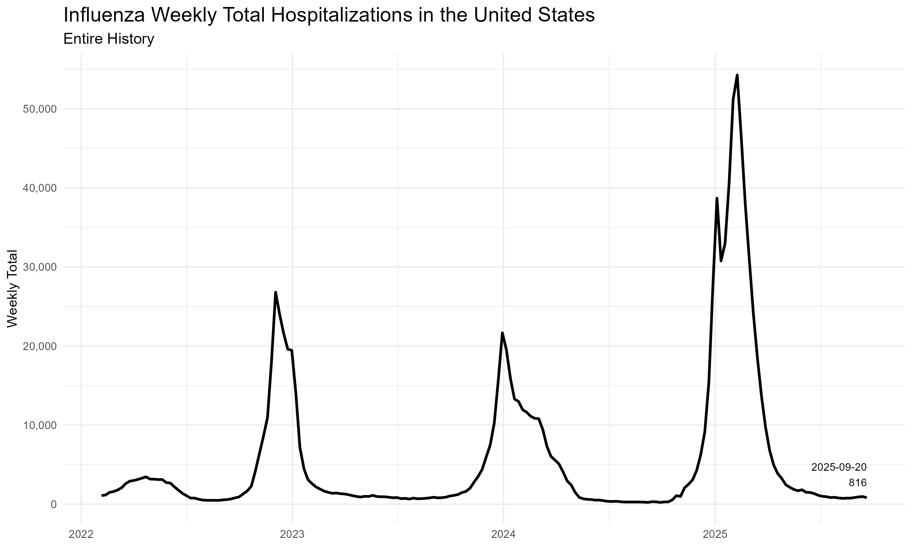
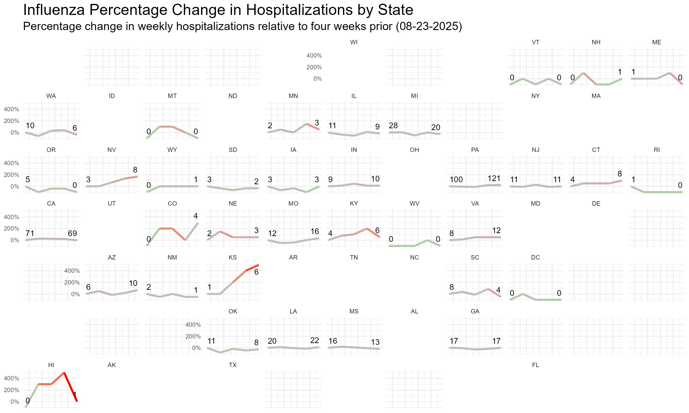

Last updated: `r format(Sys.time(), '%B %d, %Y')`

This page contains plots of influenza hospitalizations in the US. The data comes from the [CDC's FluSight](https://www.cdc.gov/flu/weekly/flusight/index.html) using their [target data](https://github.com/cdcepi/FluSight-forecast-hub/tree/main/target-data) hospitalizations figures. See their [repository](https://github.com/cdcepi/FluSight-forecast-hub/tree/main/target-data) for more details on the data. Data comes from the file `target-hospital-admissions.csv`.

Click the "Code" buttons to see the R code used on this page. An R Markdown file of this page is [available here](https://github.com/ryooan/ryooan.github.io/tree/master/forecasting) for anyone who wishes to download and run or modify it themselves.

```{r message=FALSE, warning=FALSE, fig.show='hide'}
library(tidyverse)
library(lubridate)
library(geofacet)
library(usdata)
library(zoo)
library(scales)
library(kableExtra)

url <- "https://raw.githubusercontent.com/cdcepi/FluSight-forecast-hub/main/target-data/target-hospital-admissions.csv"

influenza_data <- read_csv(url)

# Convert dates to Date objects
influenza_data <- influenza_data %>%
  mutate(date = ymd(date)) %>%
  filter(location_name != "Virgin Islands")

# Replace full state names with abbreviations using state2abbr function
influenza_data$abbr <- state2abbr(influenza_data$location_name)

# Calculate daily sums (preserving original data structure)
influenza_data_daily <- influenza_data %>%
  group_by(location_name, abbr, date) %>%
  summarize(weekly_total = sum(value, na.rm = TRUE), .groups = "drop")

# Find the latest date in influenza_data_daily
latest_date <- max(influenza_data_daily$date)

# Determine the reference rolling weekly sum for each state 28 days (four weeks) before the latest date
# If it's 0 set it to one to avoid infinities
reference_date <- latest_date - days(28)
influenza_data_reference <- influenza_data_daily %>%
  filter(date == reference_date) %>%
  select(location_name, abbr, weekly_total) %>%
  mutate(weekly_total = ifelse(weekly_total == 0, 1, weekly_total))

# Create dataset for "United States"
us_influenza_data <- influenza_data_daily %>%
  filter(location_name == "US")

# Join with the main data to compute percentage change
influenza_data_daily <- influenza_data_daily %>%
  left_join(influenza_data_reference, by = c("location_name", "abbr"), suffix = c("", "_ref")) %>%
  mutate(weekly_percentage_change = (weekly_total / weekly_total_ref - 1) * 100) %>%
  filter(date <= latest_date & date >= reference_date) # Filter for the 28 days up to the latest date

# Filter out rows with NA in the state abbreviation or percentage change
influenza_data_daily <- filter(influenza_data_daily, !is.na(abbr) & !is.na(weekly_percentage_change))

# Find the first and last date for each state
first_last_dates <- influenza_data_daily %>%
  group_by(location_name, abbr) %>%
  summarize(first_date = min(date), last_date = max(date), .groups = "drop")

# Join this information back to the main dataset
influenza_data_daily <- influenza_data_daily %>%
  left_join(first_last_dates, by = c("location_name", "abbr"))

# Determine the points to annotate
annotate_points <- influenza_data_daily %>%
  filter(date == first_date | date == last_date) %>%
  select(location_name, abbr, date, weekly_total, weekly_percentage_change, first_date, last_date)

# Calculate the dynamic offset
max_change <- max(influenza_data_daily$weekly_percentage_change, na.rm = TRUE)
min_change <- min(influenza_data_daily$weekly_percentage_change, na.rm = TRUE)

offset_percentage <- 0.2  # 20% offset
upper_offset <- max_change * offset_percentage
lower_offset <- min_change * offset_percentage

# Define a threshold for y-value
y_threshold <- max(influenza_data_daily$weekly_percentage_change) * 0.9

# Format the reference date as a character string
formatted_reference_date <- format(reference_date, "%m-%d-%Y")

# Plot the data, using state abbreviations for faceting
state_plot <- ggplot(influenza_data_daily, aes(x = date, y = weekly_percentage_change)) +
  geom_line(aes(color = weekly_percentage_change), size = 1) +
  geom_text(data = annotate_points, 
            aes(label = round(weekly_total), 
                y = ifelse(weekly_percentage_change > y_threshold, 
                           weekly_percentage_change - upper_offset, 
                           weekly_percentage_change + upper_offset),
                hjust = ifelse(date == first_date, -0, 1)), # Adjust hjust based on date
            check_overlap = TRUE, size = 3) +
  facet_geo(~ abbr, grid = "us_state_grid1") +
  labs(title = "Influenza Percentage Change in Hospitalizations by State",
       subtitle = paste("Percentage change in weekly hospitalizations relative to four weeks prior (", formatted_reference_date, ")", sep = ""),
       x = element_blank(),
       y = element_blank()) +
  scale_color_gradient2(low = "green", mid = "gray", high = "red", midpoint = 0, guide = FALSE) +
  scale_y_continuous(labels = label_percent(scale = 1)) +
  theme_minimal(base_size = 8) +
  theme(
    axis.text.x = element_blank(),
    axis.ticks.x = element_blank(),
    axis.line.x = element_blank(),
    axis.line.y = element_blank(),
    plot.title = element_text(size = 16),
    plot.subtitle = element_text(size = 12),
    strip.background = element_rect(color = "white")
  )

# Find the latest point in US data for annotation
latest_us_data <- us_influenza_data %>%
  filter(date == max(date)) %>%
  select(date, weekly_total)

# Annotation text for the latest point
annotate_text <- paste(latest_us_data$date, "\n", scales::comma(latest_us_data$weekly_total), sep = "")

# Plot for the entire history of US data
us_history_plot <- ggplot(us_influenza_data, aes(x = date, y = weekly_total)) +
  geom_line(color = "black", size = 1) +
  geom_text(data = latest_us_data, aes(label = annotate_text, x = date, y = weekly_total), 
            vjust = -0.5, hjust = 1, color = "black", size = 3) +
  scale_y_continuous(labels = scales::comma, breaks = scales::pretty_breaks(n = 6)) +
  labs(title = "Influenza Weekly Total Hospitalizations in the United States",
       subtitle = "Entire History",
       x = element_blank(),
       y = "Weekly Total") +
  theme_minimal() +
  theme(
    plot.title = element_text(size = 16),
    plot.subtitle = element_text(size = 12)
  )

# Plot for the past year of US data
one_year_ago <- latest_date - years(1)
us_influenza_data_recent <- us_influenza_data %>%
  filter(date >= one_year_ago)

us_recent_plot <- ggplot(us_influenza_data_recent, aes(x = date, y = weekly_total)) +
  geom_line(color = "black", size = 1) +
  geom_text(data = latest_us_data, aes(label = annotate_text, x = date, y = weekly_total), 
            vjust = -0.5, hjust = 1, color = "black", size = 3) +
  scale_x_date(date_breaks = "1 month", date_labels = "%b %Y") +
  scale_y_continuous(labels = scales::comma, breaks = scales::pretty_breaks(n = 10)) +
  labs(title = "Influenza Weekly Total Hospitalizations in the United States",
       subtitle = "Past Year",
       x = element_blank(),
       y = "Weekly Total") +
  theme_minimal() +
  theme(
    plot.title = element_text(size = 16),
    plot.subtitle = element_text(size = 12),
    axis.text.x = element_text(angle = 45, hjust = 1)
  )

ggsave("state_plot.png", state_plot, width = 10, height = 6, dpi = 300, bg = "white")
ggsave("us_history_plot.png", us_history_plot, width = 10, height = 6, dpi = 300, bg = "white")
ggsave("us_recent_plot.png", us_recent_plot, width = 10, height = 6, dpi = 300, bg = "white")

#creating and formatting values for table view
us_influenza_table <- us_influenza_data %>% select(date,weekly_total)
us_influenza_table <- us_influenza_table %>% arrange(desc(date))
us_influenza_table <- us_influenza_table %>%
  mutate(weekly_total = scales::comma(weekly_total))

us_influenza_kbl <- kbl(us_influenza_table,col.names = c("Date","Hospitalizations - Weekly")) %>%
  kable_minimal(full_width = F) %>%
  column_spec(1:2,width = "10em") %>%
  scroll_box(height = "500px")
```




```{r message=FALSE, warning=FALSE}

us_influenza_kbl

```

&nbsp;
&nbsp;

The figure below shows the relative change in weekly hospitalizations in each state in the most recent four weeks, relative to the figure from four weeks ago. The starting and ending weekly sum of hospitalizations are shown on each chart.

