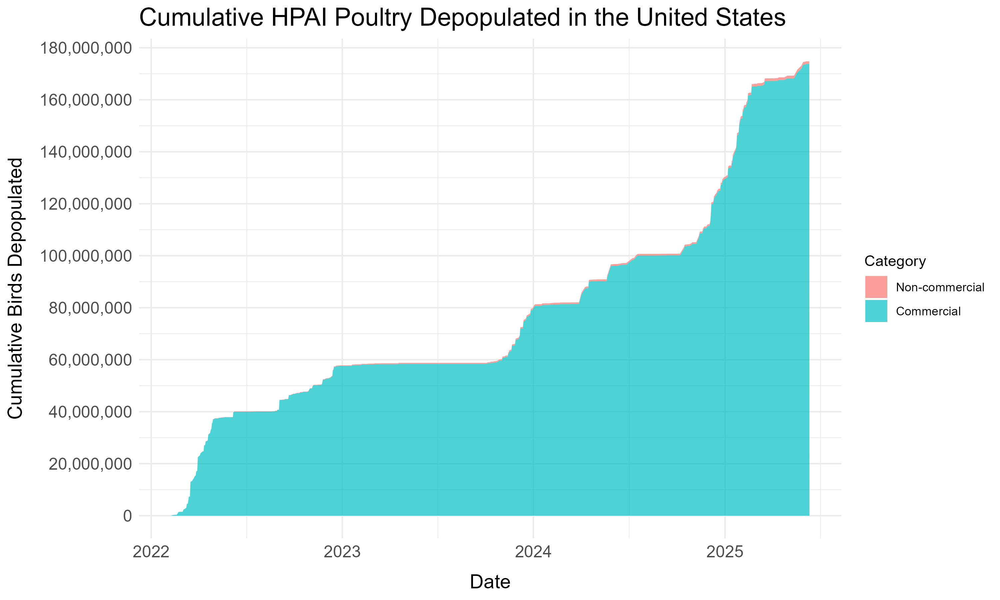
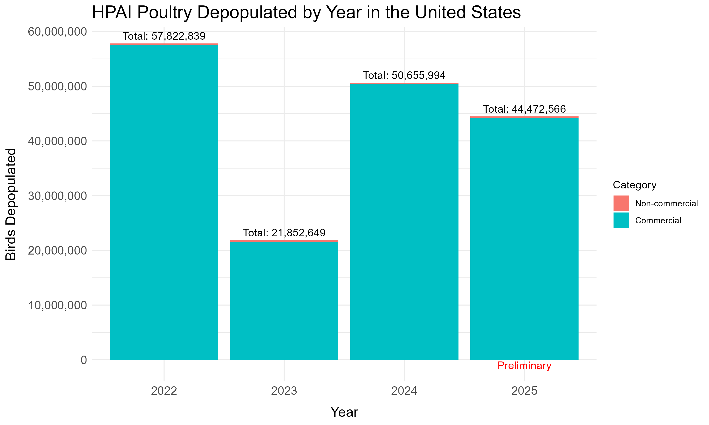

Last updated: `r format(Sys.time(), '%B %d, %Y')`

This page contains plots of the number of birds depopulated due to the highly pathogenic avian influenza (HPAI) outbreak. The USDA maintains a page [tracking the number of confirmed HPAI detections](https://www.aphis.usda.gov/livestock-poultry-disease/avian/avian-influenza/hpai-detections/commercial-backyard-flocks) in commercial and backyard flocks, as well as the number of "Birds Affected" in those flocks, meaning those birds have been killed or "depopulated" according to [USDA policy](https://www.aphis.usda.gov/livestock-poultry-disease/avian/avian-influenza). The data presented on this page comes from what appears to be a [CDC mirror of the data](https://www.cdc.gov/bird-flu/situation-summary/data-map-commercial.html), which shows the same data as of December 20, 2024. This data is used for context on the Metaculus forecasting question: [How many farmed birds will be killed in the United States due to bird flu in 2025?](https://www.metaculus.com/questions/31129/farmed-birds-killed-in-us-due-to-bird-flu-in-2025/)

Click the "Code" buttons to see the R code used on this page. An R Markdown file of this page is [available here](https://github.com/ryooan/ryooan.github.io/tree/master/forecasting) for anyone who wishes to download and run or modify it themselves.

```{r message=FALSE, warning=FALSE, fig.show='hide'}
library(tidyverse)
library(lubridate)

# Download the CSV file
data_url <- "https://www.cdc.gov/bird-flu/modules/situation-summary/commercial-backyard-flocks.csv"
data <- read_csv(data_url)

# Categorize entries by whether they're Commercial or Non-commercial
data <- data %>%
  mutate(Category = if_else(str_detect(tolower(`Flock Type`), "commercial"), "Commercial", "Non-commercial"))

# Convert "Outbreak Date" to Date type
data <- data %>%
  mutate(`Outbreak Date` = parse_date_time(`Outbreak Date`, orders = "mdy"))

# Prepare data for cumulative sum plot
cumulative_data <- data %>%
  group_by(`Outbreak Date`, Category) %>%
  summarise(Flock_Size = sum(`Flock Size`, na.rm = TRUE), .groups = "drop") %>%
  pivot_wider(names_from = Category, values_from = Flock_Size, values_fill = 0) %>%
  arrange(`Outbreak Date`) %>%
  mutate(
    Cum_Commercial = cumsum(Commercial),
    Cum_Non_Commercial = cumsum(`Non-commercial`)
  ) %>%
  pivot_longer(cols = starts_with("Cum_"), names_to = "Category", values_to = "Cumulative_Flock_Size")

# Plot cumulative sum of flock sizes
cumulative_data <- cumulative_data %>%
  mutate(Category = case_when(
    Category == "Cum_Commercial" ~ "Commercial",
    Category == "Cum_Non_Commercial" ~ "Non-commercial",
    TRUE ~ Category
  ))

cumulative_plot <- ggplot(cumulative_data, aes(x = `Outbreak Date`, y = Cumulative_Flock_Size, 
                            fill = fct_rev(fct_relevel(Category, "Commercial", "Non-commercial")))) +
  geom_area(alpha = 0.7) +
  labs(
    title = "Cumulative HPAI Poultry Depopulated in the United States",
    x = "Date",
    y = "Cumulative Birds Depopulated",
    fill = "Category"
  ) +
  scale_y_continuous(labels = scales::comma, breaks = scales::pretty_breaks(n = 8)) +
  theme_minimal() +
  theme(
    axis.title.x = element_text(margin = margin(t = 10), size = 14),  # Add top margin to x-axis label
    axis.title.y = element_text(margin = margin(r = 10), size = 14),  # Add right margin to y-axis label
    plot.title = element_text(size = 18),
    axis.text.x = element_text(size = 12),
    axis.text.y = element_text(size = 12)
  )


# Prepare data for yearly bar graph
yearly_data <- data %>%
  mutate(Year = format(`Outbreak Date`, "%Y")) %>%
  group_by(Year, Category) %>%
  summarise(Flock_Size = sum(`Flock Size`, na.rm = TRUE), .groups = "drop")

current_year <- format(Sys.Date(), "%Y")

yearly_totals <- yearly_data %>%
  group_by(Year) %>%
  summarise(Total = sum(Flock_Size))

# Plot yearly bar graph
annual_plot <- ggplot(yearly_data, aes(x = Year, y = Flock_Size)) +  # Removed fill from global aes
  geom_bar(aes(fill = fct_relevel(Category, "Non-commercial", "Commercial")), 
           stat = "identity", position = "stack") +  # Added fill to geom_bar
  geom_text(
    data = yearly_totals,
    aes(y = Total, label = paste0("Total: ", scales::comma(Total))),
    vjust = -0.5, color = "black"
  ) +
  geom_text(
    data = yearly_data %>% filter(Category == "Non-commercial" & Year == current_year),
    aes(label = "Preliminary", y = -1000000),
    color = "red"
  ) +
  labs(
    title = "HPAI Poultry Depopulated by Year in the United States",
    x = "Year",
    y = "Birds Depopulated",
    fill = "Category"
  ) +
  scale_y_continuous(labels = scales::comma, breaks = scales::pretty_breaks(n = 8)) +
  theme_minimal() +
  theme(
    axis.title.x = element_text(margin = margin(t = 10), size = 14),  # Add top margin to x-axis label
    axis.title.y = element_text(margin = margin(r = 10), size = 14),  # Add right margin to y-axis label
    plot.title = element_text(size = 18),
    axis.text.x = element_text(size = 12),
    axis.text.y = element_text(size = 12)
  )

ggsave("cumulative_depopulations.png", cumulative_plot, width = 10, height = 6, dpi = 300, bg = "white")
ggsave("annual_depopulations.png", annual_plot, width = 10, height = 6, dpi = 300, bg = "white")
```



